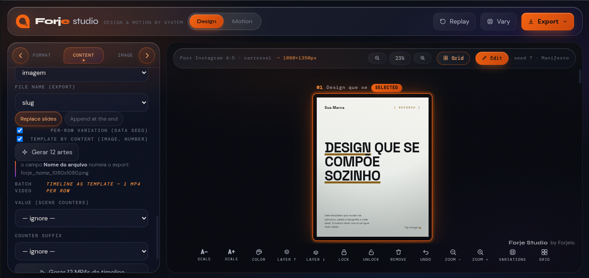

<div align="center">



**Design and motion, exported for real — from a single HTML file.**

No build. No server. No sign-up. No image AI.
Open `index.html` and the studio is running.

[**Open the studio →**](https://studio.forjelo.com)

</div>

<!--
  IMAGEM 1 — demo principal
  Capturar: cena montada + clique em export + vídeo pronto. 10-15s.
  Salvar em assets/demo.gif
-->
<p align="center">
  
</p>

---

## What it does

A persistent brandbook drives deterministic templates and a scene compositor across two modes.

**Design** — carousel slides combining template × format × per-slide image and mask. Eight page-indicator styles, full manual editing: drag, scale, lock, align-to-guides, multi-select.

**Motion** — a scene timeline (logo intro, statement, icon point, showcase, counter, CTA) with 15+ entrance and exit transitions per scene, played live on stage exactly as it renders to video.

Composition draws from **90+ components** — cards, KPIs, real SVG charts, terminals, QR codes and Code 128 barcodes generated from scratch, ~44 geometric shapes, and 8 procedurally generated backgrounds. All built on a registry a plugin can extend without touching source.

<!--
  IMAGEM 2 — a interface
  Capturar: screenshot do studio com uma composição carregada,
  painéis visíveis. Salvar em assets/interface.png
-->
<p align="center">
  
</p>

---

## Exports

Everything full-bleed and deterministic. What you see on stage is what lands in the file.

| Format | How |
|---|---|
| **MP4** | frame-exact, via WebCodecs |
| **WebM** | native encode |
| **PNG / JPG** | full-bleed raster |
| **HTML** | standalone player, single file |
| **PDF** | hand-written writer, zero dependencies |
| **PPTX** | hand-written OOXML — opens in PowerPoint, imports into Google Slides |

The PDF and PPTX writers are written from scratch in this repo. No library produces them.

Nothing from the tool itself — snap guides, selection boxes, handles — ever reaches the art.

---

## Running it

```bash
git clone https://github.com/forjelo/forje-studio.git
cd forje-studio
xdg-open index.html    # or just double-click it
```

That's the whole setup. No `npm install`, no bundler, no dev server.

Three dependencies are vendored in `vendor/`, committed and pinned — nothing is fetched at runtime, no CDN, no network call:

| Dependency | Role | License |
|---|---|---|
| `html-to-image` | DOM → raster | MIT |
| `mp4-muxer` | MP4 container muxing | MIT |
| `qrcode-generator` | QR encoding | MIT |

---

# Development guide

Everything below is for extending the studio. None of it is needed to use it.

## Architecture

There is no module system and no bundler at runtime. Scripts load in a fixed order defined by `JS_ORDER` in `build.py`, and each layer assumes the ones before it are already in place. **That order is the dependency graph.**

```
 1-6    core/       state · palette · composer · content · batch · i18n
 7-14   lib/        fonts · icons · anims · bgs · shapes · codes · components
15-17   templates/  static · extra · doc
18-20   motion/     scenes · scenes-extra · player
21-23   core/       render · export · export-doc
24-28   ui/         editor · panels · resize · boards · variations
29-30   core/       growth · app
```

Read top to bottom: **state and registries first, then what populates them, then rendering and export, then the interface, then bootstrap.** `js/app.js` loads last and wires everything together.

The practical rule: a module can only reference what loads before it. Where you place a new file in `JS_ORDER` decides what it can see.

## Layout

```
index.html      the studio — loads every module in order
css/
  app.css       studio chrome (panels, toolbars, editor UI)
  art.css       canvas styles — injected into <style id="artcss">
js/
  core/         state, composition, rendering, export
  lib/          registries — components, shapes, backgrounds, codes
  templates/    slide template definitions
  motion/       scene definitions and the timeline player
  ui/           editor, panels, resize, boards, variations
vendor/         three pinned dependencies
build.py        optional single-file bundler
dist/           bundler output
```

## The two stylesheets

This split matters and is easy to get wrong.

**`css/app.css`** styles the studio itself — panels, toolbars, buttons, editor chrome. None of it reaches the artwork.

**`css/art.css`** styles the canvas. It is injected into the `<style id="artcss">` block inside `index.html`, and the HTML and PNG exporters read that block at runtime to reproduce the art faithfully outside the studio.

That injection is what `build.py` does. **After editing `art.css`, run the build** — otherwise the exporters serve a stale copy while the live canvas shows your changes, and exports silently diverge from the stage.

```bash
python3 build.py
```

`app.css` needs no build step.

## Building the single-file bundle

```bash
python3 build.py
# → dist/forje-studio-preview.html
```

Two things happen:

1. `css/art.css` is injected into the `<style id="artcss">` block of `index.html`.
2. Every CSS and JS module — plus the three vendored libraries — is inlined into one portable HTML file at `dist/forje-studio-preview.html`.

The bundle is for sharing the studio as a single artifact, or running it somewhere that accepts exactly one file. It is not required to develop or use the studio.

`build.py` depends only on the Python standard library.

## Adding a module

1. Create the file under the layer it belongs to (`js/lib/`, `js/templates/`, `js/motion/`, `js/ui/`).
2. Add a `<script src="...">` tag to `index.html`, positioned to match its layer.
3. Add the same path to `JS_ORDER` in `build.py`, at the same position.

**Both lists must agree.** If they drift, the studio and the bundle behave differently — the kind of bug that only surfaces after an export.

## Adding to a registry

Components, shapes, backgrounds, and codes live in registries under `js/lib/`. Templates and scenes follow the same pattern in `js/templates/` and `js/motion/`. A registry entry can be added without touching the modules that consume it — that is what makes the studio extensible without a plugin API.

<!--
  COMPLETAR: exemplo mínimo de registro.
  Abrir js/lib/components.js, copiar a menor entrada existente
  e colar aqui como exemplo canônico, com a assinatura real.
  Sem isso o leitor não sabe como registrar de fato.
-->

## Canvas styles and export fidelity

Anything that should appear in exported artwork belongs in `art.css` and must survive rasterization by `html-to-image`. Studio-only affordances — snap guides, selection outlines, resize handles — belong in `app.css`, which the exporters never see. That separation is why nothing from the tool leaks into the art.

## Conventions

- **No runtime fetches.** Everything ships in the repo. A change that introduces a CDN call or network request doesn't belong here.
- **Deterministic output.** The same composition produces the same file every time. No timestamps, no unseeded randomness.
- **Vanilla only.** No framework, no build-time transform. The source you read is the source that runs.

---

## License

MIT — see [LICENSE](LICENSE).

Vendored dependencies keep their own licenses, included alongside each file in `vendor/`.

---

<div align="center">
<sub>Handcrafted by <a href="https://forjelo.com"><b>Forjelo</b></a> — we forge systems and products at this level for your brand.</sub>
</div>
